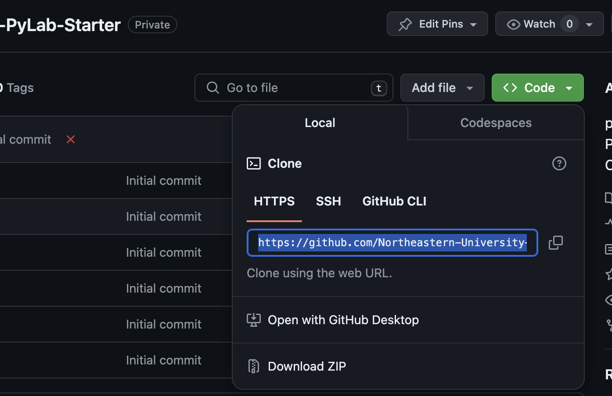
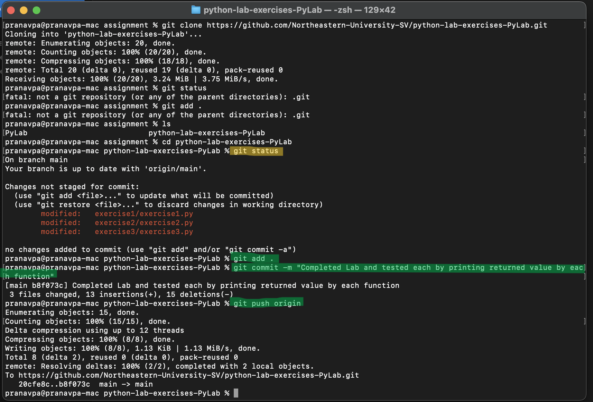
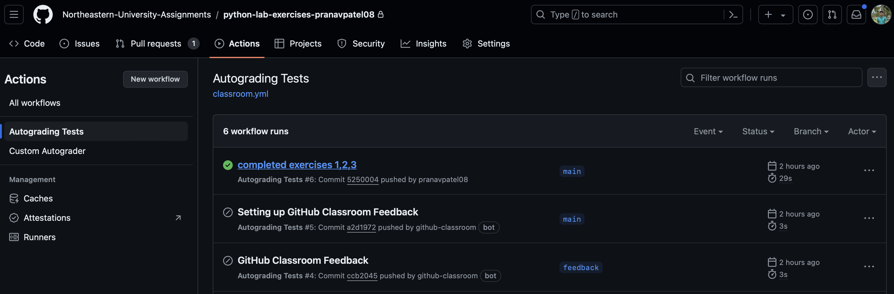
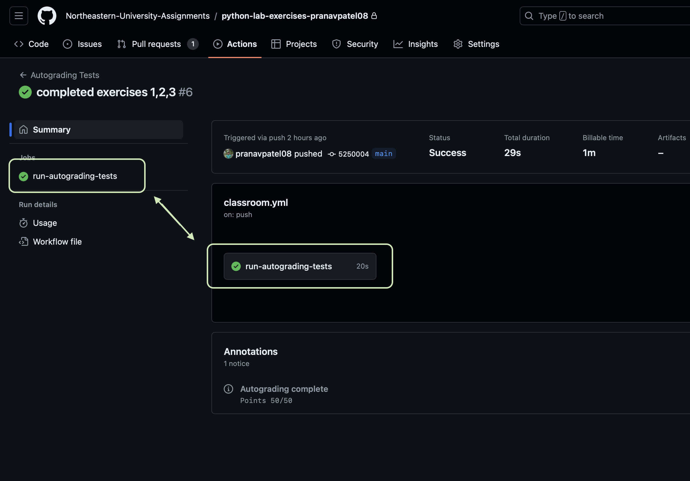
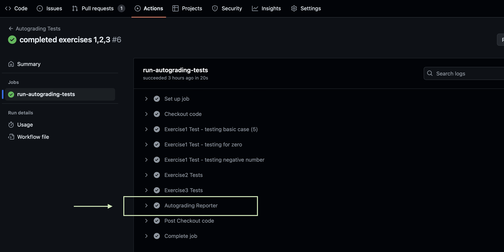
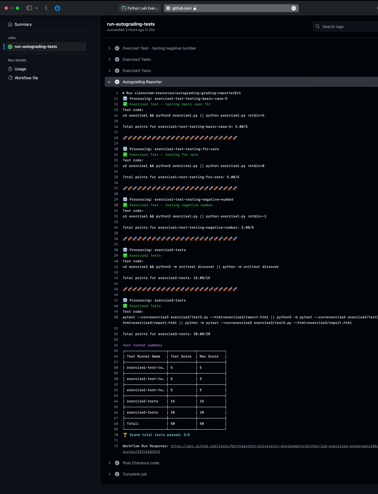

# Lab 1: Python Basics for Machine Learning

Welcome to the Lab 1 Exercises! This repository contains exercises for the first lab, designed to enhance your skills in Python by covering essential concepts such as data structures, sets, and package importing for machine learning.

## Lab Setup
### Prerequisites:
* Ensure you have Python 3.x installed on your system.
* You'll need a working internet connection to install any required Python packages.
* If working in a virtual environment, activate it before running the exercises.

### Cloning the repository
1. Clone the Repository

   Open your terminal and enter the following command to clone the repository:
   ```jsx
   git clone https://github.com/Northeastern-University-SV/<name_of_repository_created>.git
   ```
   * Note: Replace `name_of_repository_created` with your repository. URL can be found by clicking on `< > Code`:  


2. Navigate to the folder where repository is cloned:
   ```jsx
   cd PyLab1
   ```

3. Sync the repository:
   ```jsx
   git pull origin main
   ```

### File Overview:
* `./Lab1.1.py`: Exercise 1 - Code for List Basics.
* `./Lab1.2.py`: Exercise 2 - Code for Set Basics.
* `./Lab1.3.py`: Exercise 3 - Code for Importing Packages and working with the dataset.
* `./dataset/homes.csv`: Dataset for Lab 1.3.
* `./README.md`: This guide.


## Lab Exercises Overview
### **Lab 1.1: List Basics**
In this exercise, you will work with Python lists.
Given the user inputs, complete a program that does the following tasks:

* Define a list, `myList`, containing the user inputs `myFlower1`, `myFlower2`, and `myFlower3` in the same order.
* Define a list, `yourList`, containing the user inputs `yourFlower1` and `yourFlower2` in the same order.
* Define a list, `ourList`, by concatenating `myList` and `yourList`.
* Append the user input `theirFlower` to the end of `ourList`.
* Replace `myFlower2` in `ourList` with `theirFlower`.
* Remove the third element of `ourList`.

Observe the output of each print statement carefully to understand what was done by each task of the program.

Ex: If the input is:

```
rose
peony
lily
rose
daisy
aster
```
the output is:
```
['rose', 'peony', 'lily']
['rose', 'daisy']
['rose', 'peony', 'lily', 'rose', 'daisy']
['rose', 'peony', 'lily', 'rose', 'daisy', 'aster']
['rose', 'aster', 'lily', 'rose', 'daisy', 'aster']
['rose', 'aster', 'rose', 'daisy', 'aster']
```

### **Lab 1.2: Set Basics**

Given the user inputs, complete a program that does the following tasks:

* Define a set, `fruits`, containing the user inputs `myFruit1`, `myFruit2`, and `myFruit3`.
* Add the user input `theirFruit` to `fruits`.
* Find the intersection of `fruits` and `yourFruit1` and `yourFruit2`
* Remove `myFruit1` from `fruits`.

Note: For testing purposes, sets are printed using sorted() for comparison.

Ex: If the input is:
```
apple
peach
lemon
apple
pear
plum
```
the output is:

```
['apple', 'lemon', 'peach']
['apple', 'lemon', 'peach', 'plum']
['apple']
['lemon', 'peach', 'plum']
```

### **LAB 1.3: Importing packages**

Import the necessary modules and read in a csv file. The `homes` dataset contains 18 features giving the characteristics of 76 homes being sold. The modules will be used with the `homes.csv` file to perform a linear regression. Linear regression will be covered in a different chapter.

- Import the `NumPy` and `pandas` packages with the aliases used in this material
- Import the function `LinearRegression` from the `sklearn.linear_model` package
- Read in the csv file `homes.csv`

Ex: If the csv file `homes_small.csv` is used instead of `homes.csv`, the output is:
```
The intercept of the regression is 249.522
The slope of the regression is 36.758
```

## Submitting Your Work ✅

After completing the Lab:

1. Commit your changes:
   ```jsx
   git add .
   git commit -m "Completed Lab X"
   ```
   * Note: Write meaningful commit messages.

2. Push your changes:
   ```jsx   
   git push origin main
   ```
   


## Want it simpler? 😓
You can use the [GitHub Desktop](https://desktop.github.com/) app to get started hasstle free.  
1. 🪞 Clone Repository from `File` menu-tab.
2. 🔗 Enter the path and the URL to the repository that just got created:
   ```jsx   
   https://github.com/Northeastern-University-SV/<name_of_repository_created>.git
   ```
* Note: Replace `name_of_repository_created` with your repository. 
3. 🔁 Once cloned, fetch origin.
4. ✚ The changes done in the path would be reflected in the sidebar of the application. 
5. ✍️ Enter a meaningful message in the `Summary` and `Commit to main`
6. ⬆️ Push to origin   


## Grading and Feedback 💯
Each Lab is configured with an autograder that provides immediate feedback on your submissions.

### Accessing Test Results 📑

1. Go to:
```jsx
   https://github.com/Northeastern-University-SV/<name_of_repository_created>/actions/workflows/classroom.yml
```
* Note: Replace `name_of_repository_created` with your repository. 

2. Find the workflow run for your latest push

3. Click on `run-autograding-tests`
 
4. Expand `Autograding Reporter` to see your results




## Help and Discussion 🤔
* Report any issues or ask questions using the [Issues](https://github.com/Northeastern-University-SV/PyLab1/issues) tab.
* Use the [Discussions](https://github.com/Northeastern-University-SV/PyLab1/discussions) tab to ask questions, share your progress, and help each other.

#### *Enjoy the lab exercises and happy coding!* 🧑🏻‍💻🧑🏻‍💻🧑🏻‍💻